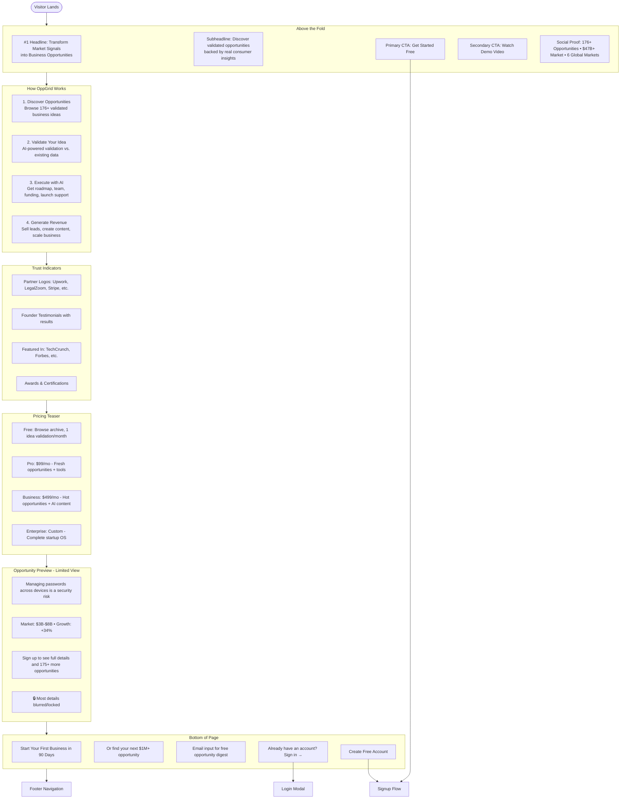

# **🎨 Frontend User Flow: Landing Page vs. Logged-In Experience**

## **1. LANDING PAGE (Unauthenticated)**



---

## **2. SIGNUP/ONBOARDING FLOW**

```mermaid
flowchart TB
    StartSignup([Get Started Click]) --> SignupModal[Signup Modal]
    
    subgraph SignupModal [Quick Signup]
        EmailInput[Email address]
        PasswordInput[Create password]
        ContinueButton[Continue with Email]
        SocialAuth[Google / LinkedIn / GitHub]
        Terms[By continuing, you agree to terms]
    end
    
    SignupModal --> AIOnboarding[AI Onboarding Questionnaire]
    
    subgraph AIOnboarding [AI Profile Builder - 2 min]
        Q1[What's your primary goal?<br>• Start a business<br>• Find investment opportunities<br>• Validate existing idea<br>• Generate side income]
        
        Q2[Your background?<br>• First-time founder<br>• Serial entrepreneur<br>• Investor<br>• Corporate innovation<br>• Student]
        
        Q3[Skills & interests?<br>• Tech/development<br>• Marketing/sales<br>• Healthcare<br>• FinTech<br>• E-commerce<br>• SaaS]
        
        Q4[Available resources?<br>• Time per week: <10h / 10-20h / 20-40h / 40h+<br>• Capital: <$1k / $1-10k / $10-50k / $50k+]
        
        Q5[Risk tolerance?<br>• Conservative (low risk)<br>• Balanced<br>• Aggressive (high risk)]
    end
    
    AIOnboarding --> ProfileGenerated[AI Profile Generated!]
    
    subgraph ProfileGenerated [Your AI Co-pilot is Ready]
        Welcome[Welcome, [Name]! Your AI co-pilot has been customized for you.]
        MatchScore[Match Score: 87/100 with current opportunities]
        Recommendations[Based on your profile, we recommend:]
        Rec1[• Healthcare SaaS opportunities (best match)]
        Rec2[• 10-20 hour/week commitment projects]
        Rec3[• $5-50k capital requirement ideas]
        ActionButton[🚀 Show Me My Opportunities]
    end
    
    ProfileGenerated --> DashboardRedirect[Redirect to Main Dashboard]
```

---

## **3. LOGGED-IN MAIN DASHBOARD**

```mermaid
flowchart TB
    StartDash([Logged In]) --> Dashboard[Main Dashboard]
    
    subgraph Dashboard [Personalized Dashboard]
        NavBar[OppGrid Logo • Search • Notifications • User Menu]
        
        WelcomeBar[Welcome back, Alex! • AI Match Score: 87 • Daily opportunity digest ready]
        
        QuickActions[Quick Actions]
        
        subgraph QuickActions [One-Click Actions]
            QA1[🚀 Find New Opportunity]
            QA2[🔍 Validate My Idea]
            QA3[📈 Generate Leads]
            QA4[📋 Create Business Plan]
            QA5[👥 Find Co-founder]
            QA6[💰 Check Funding Options]
        end
        
        OpportunityFeed[Personalized Opportunity Feed]
        
        subgraph OpportunityFeed [AI-Curated Opportunities]
            Opp1[🔥 HOT - 2d<br>Voice-based medical notes for doctors<br>Market: $3-8B • Match: 92%<br>[View Details] [Save]]
            
            Opp2[🆕 FRESH - 15d<br>AI meal planning for busy parents<br>Market: $500M-2B • Match: 85%<br>[View Details] [Save]]
            
            Opp3[✅ VALIDATED - 45d<br>Sustainable e-commerce packaging<br>Market: $2-5B • Match: 78%<br>[View Details] [Save]]
            
            SeeMore[See 12 more opportunities →]
        end
        
        ProgressTrackers[Your Progress Trackers]
        
        subgraph ProgressTrackers [Active Projects]
            PT1[MedTech App • Week 3/12 • 65% complete<br>Next: Hire developer • Due: 2 days]
            
            PT2[Lead Generation • 247 leads created • $4,795 earned<br>[Manage Leads] [Withdraw]]
            
            PT3[Market Study Template • 47 sales • $3,760 royalties<br>[Analytics] [Create New]]
        end
        
        AIRecommendations[AI Recommendations]
        
        subgraph AIRecommendations [Your AI Co-pilot Suggests]
            AR1[💡 Based on your skills, consider:<br>Healthcare compliance consulting]
            AR2[📊 Your leads convert 3.2x better in:<br>FinTech sector]
            AR3[👥 You need: Technical co-founder<br>[Find Match]]
            AR4[💰 Funding alert: Healthcare grants due<br>in 14 days [Apply]]
        end
        
        Trending[Trending in Your Network]
        
        subgraph Trending [Community Activity]
            T1[Sarah launched her SaaS • 45 days • $12k MRR]
            T2[Mark sold 500 leads • $15k revenue]
            T3[Tech Ventures looking for AI startups [Pitch]]
            T4[Healthcare webinar tomorrow [Register]]
        end
    end
    
    QuickActions --> CorrespondingPages[Action Pages]
    OpportunityFeed --> OppDetails[Opportunity Details]
    ProgressTrackers --> ProjectDashboards[Project Dashboards]
    AIRecommendations --> RecommendationDetails[Detailed Recommendations]
    Trending --> CommunityPages[Community Pages]
    
    NavBar --> MainNavigation[Main Navigation]
    
    subgraph MainNavigation [Logged-In Navigation Structure]
        Nav1[🏠 Dashboard]
        Nav2[🔍 Discover]
        Nav3[🚀 Builder]
        Nav4[📈 Leads]
        Nav5[📋 Content]
        Nav6[👥 Network]
        Nav7[💰 Funding]
        Nav8[🛠️ Tools]
        Nav9[📚 Learn]
    end
```

---

## **4. KEY PAGE EXPERIENCES (Logged-In)**

### **Page A: Discover Opportunities**
```
OPPGRID • DISCOVER
┌─────────────────────────────────────────────────────┐
│ Search opportunities... 🔍                          │
│                                                     │
│ Filters:                                            │
│ [ ] 🔥 HOT (0-7 days)   [Your Tier: 🔒 Enterprise]  │
│ [✓] 🆕 FRESH (8-30d)    [Access: ✅ Pro Required]    │
│ [✓] ✅ VALIDATED (31-90d)[Access: ✅ Explorer+]      │
│ [✓] 📁 ARCHIVE (90+ days)[Access: ✅ Everyone]       │
│                                                     │
│ Industry: [All] • Market Size: [All] • Region: [All]│
│ Match Score: [70%+] • Growth: [20%+]                │
│                                                     │
│ ┌─────────────────────────────────────────────────┐ │
│ │ 🆕 FRESH • 15d • Match: 92%                     │ │
│ │                                                 │ │
│ │ ### AI-Powered Meal Planning for Busy Parents  │ │
│ │                                                 │ │
│ │ 📊 Market: $500M-2B • 📈 Growth: +34%          │ │
│ │ 👥 Validations: 534 • 🌍 Regions: 3            │ │
│ │                                                 │ │
│ │ ❗ Access: Requires Pro ($399/mo)               │ │
│ │                                                 │ │
│ │ [🔓 Quick Look - $29] or [⬆️ Upgrade to Pro]    │ │
│ └─────────────────────────────────────────────────┘ │
│                                                     │
│ ┌─────────────────────────────────────────────────┐ │
│ │ ✅ VALIDATED • 45d • Match: 87%                 │ │
│ │                                                 │ │
│ │ ### Sustainable E-commerce Packaging           │ │
│ │                                                 │ │
│ │ 📊 Market: $2-5B • 📈 Growth: +22%             │ │
│ │ 👥 Validations: 321 • 🌍 Regions: 6            │ │
│ │                                                 │ │
│ │ ✅ Access: Included in your Explorer plan      │ │
│ │                                                 │ │
│ │ [View Full Details] [Save] [Share]             │ │
│ └─────────────────────────────────────────────────┘ │
│                                                     │
│ ┌─────────────────────────────────────────────────┐ │
│ │ 🔥 HOT • 2d • Match: 95%                        │ │
│ │                                                 │ │
│ │ ### Voice-Based Medical Notes for Doctors      │ │
│ │                                                 │ │
│ │ 📊 Market: $3-8B • 📈 Growth: +41%             │ │
│ │ 👥 Validations: 87 • 🌍 Regions: 1             │ │
│ │                                                 │ │
│ │ 🔒 Access: Enterprise Only ($2,499/mo)         │ │
│ │                                                 │ │
│ │ [🔓 Fast Pass - $99] [💎 Upgrade to Enterprise] │ │
│ └─────────────────────────────────────────────────┘ │
│                                                     │
│ Showing 3 of 47 opportunities • Sorted by: Match % │
└─────────────────────────────────────────────────────┘
```

### **Page B: Startup Builder Dashboard**
```
OPPGRID BUILDER • MEDTECH APP PROJECT
┌─────────────────────────────────────────────────────┐
│ Project: Voice-based medical notes • Week 3/12      │
│ Success Probability: 78% • AI Confidence: High      │
├─────────────────────────────────────────────────────┤
│                                                     │
│ 📊 PROGRESS OVERVIEW                                │
│ ┌─────────────────────────────────────────────────┐ │
│ │ Phase 1: Validation     ✅ 100% Complete        │ │
│ │ Phase 2: Planning       🟡 80% Complete         │ │
│ │ Phase 3: Build          🟡 45% Complete         │ │
│ │ Phase 4: Launch         ⚪ 0% Complete          │ │
│ └─────────────────────────────────────────────────┘ │
│                                                     │
│ 🎯 THIS WEEK'S GOALS (Week 3)                       │
│ ✓ Complete HIPAA compliance assessment             │ │
│ ✓ Hire backend developer (2 days overdue)          │ │
│ • Interview 5 beta users                           │ │
│ • Create MVP feature backlog                       │ │
│                                                     │
│ 🛠️ RECOMMENDED TOOLS & SERVICES                     │
│ ┌─────────────────────────────────────────────────┐ │
│ │ 👥 TEAM BUILDING                                │ │
│ │ Need: Senior backend dev (Node.js + HIPAA)      │ │
│ │ Budget: $8-12k/month                            │ │
│ │ [🔍 Find on Upwork] [👥 Match with AI]          │ │
│ └─────────────────────────────────────────────────┘ │
│ ┌─────────────────────────────────────────────────┐ │
│ │ ⚖️ LEGAL & COMPLIANCE                           │ │
│ │ Need: HIPAA compliance package                  │ │
│ │ Estimated: $3-5k                                │ │
│ │ [📋 Get LegalZoom Quote] [⚖️ Expert Review]     │ │
│ └─────────────────────────────────────────────────┘ │
│                                                     │
│ 💰 FINANCIAL TRACKER                                │
│ Spent: $4,850 • Remaining: $15,150 • Runway: 14 wks│
│                                                     │
│ 📈 AI INSIGHTS & PREDICTIONS                       │ │
│ • MVP completion: 6 weeks at current pace          │ │
│ • Key risk: HIPAA compliance timeline              │ │
│ • Recommended: Hire compliance officer             │ │
│ • Market timing: Optimal launch in Q3              │ │
│                                                     │
│ [📊 Detailed Analytics] [🔄 Adjust Plan] [💬 AI Chat]│
└─────────────────────────────────────────────────────┘
```

### **Page C: Lead Generation Studio**
```
OPPGRID LEADS • GENERATION STUDIO
┌─────────────────────────────────────────────────────┐
│ Leads Generated: 247 • Quality Score: 87%           │
│ Total Earned: $6,850 • Available: $4,795            │
├─────────────────────────────────────────────────────┤
│                                                     │
│ 🚀 AI LEAD GENERATOR                                │
│ Generate leads for: [Healthcare Startups] ▼         │
│ Target: [CTOs at Series B Companies] ▼              │
│ Quantity: [100] leads ▼                             │
│                                                     │
│ 💰 PRICE ESTIMATE: $28-42 per lead                  │
│ Est. time: 2 hours • Est. revenue: $2,800-4,200     │
│                                                     │
│ [   Generate Leads with AI - $99   ]                │
│                                                     │
│ 🎯 ACTIVE LISTINGS                                  │
│ ┌─────────────────────────────────────────────────┐ │
│ │ SaaS CFO Contacts                               │ │
│ │ Leads: 45 • Price: $37 • Quality: 92%           │ │
│ │ Views: 142 • Sold: 23 • Revenue: $851           │ │
│ │ [Edit] [Promote] [Analytics]                    │ │
│ └─────────────────────────────────────────────────┘ │
│ ┌─────────────────────────────────────────────────┐ │
│ │ Healthcare Startup Founders                     │ │
│ │ Leads: 102 • Price: $42 • Quality: 88%          │ │
│ │ Views: 89 • Sold: 15 • Revenue: $630            │ │
│ │ [Edit] [Promote] [Analytics]                    │ │
│ └─────────────────────────────────────────────────┘ │
│                                                     │
│ 📊 LEAD ANALYTICS                                   │
│ • Conversion rate: 3.2%                             │ │
│ • Avg deal size: $45k                               │ │
│ • Top buyer: Tech Ventures Inc.                     │ │
│ • Best performing: SaaS CTO leads                   │ │
│                                                     │
│ 💸 EARNINGS DASHBOARD                               │
│ ┌─────────────────────────────────────────────────┐ │
│ │ This Month: $1,240                               │ │
│ │ Last Month: $980                                 │ │
│ │ Total: $6,850                                    │ │
│ │ [Withdraw Funds] [Set Up Auto-Payout]            │ │
│ └─────────────────────────────────────────────────┘ │
│                                                     │
│ [🏪 Lead Marketplace] [📈 Buyer Analytics] [🔄 Auto-Gen]│
└─────────────────────────────────────────────────────┘
```

### **Page D: AI Content Studio**
```
OPPGRID CONTENT • AI STUDIO
┌─────────────────────────────────────────────────────┐
│ Documents Created: 12 • Revenue: $8,450             │
│ Templates Sold: 47 • Royalties: $3,760              │
├─────────────────────────────────────────────────────┤
│                                                     │
│ ✨ CREATE NEW DOCUMENT                               │
│ ┌─────────────────────────────────────────────────┐ │
│ │ [🎯] Feasibility Study                          │ │
│ │ [📈] Market Research Report                    │ │
│ │ [📊] Financial Model                            │ │
│ │ [📋] Business Plan                              │ │
│ │ [🎨] Pitch Deck                                 │ │
│ │ [⚖️] Competitive Analysis                       │ │
│ └─────────────────────────────────────────────────┘ │
│                                                     │
│ 🎯 QUICK START: MARKET STUDY                        │
│ Industry: [FinTech] ▼                               │
│ Geography: [North America] ▼                        │
│ Timeframe: [2024-2026] ▼                            │
│ Depth: [Comprehensive] ▼                            │
│                                                     │
│ ⚡ AI WILL GENERATE:                                 │
│ ✓ 50+ pages analysis                               │ │
│ ✓ 20+ charts & graphs                              │ │
│ ✓ Executive summary                                │ │
│ ✓ Competitor profiles                              │ │
│ ✓ Growth projections                               │ │
│                                                     │
│ 💰 PRICING OPTIONS:                                 │
│ ⚪ AI-Only: $499 (Instant)                          │ │
│ ⚫ AI + Expert Review: $1,499 (48h)                 │ │
│ 🔵 Custom Research: $4,999+ (Schedule call)         │ │
│                                                     │
│ [   Start AI Research   ]                           │ │
│                                                     │
│ 📈 YOUR TOP PERFORMING CONTENT                      │
│ ┌─────────────────────────────────────────────────┐ │
│ │ SaaS Financial Model Template                   │ │
│ │ Price: $399 • Sales: 82 • Revenue: $2,048       │ │
│ │ Your Share: $1,230 (60%)                        │ │
│ │ [Edit] [Duplicate] [Analytics]                  │ │
│ └─────────────────────────────────────────────────┘ │
│ ┌─────────────────────────────────────────────────┐ │
│ │ Healthcare Market Study                         │ │
│ │ Price: $599 • Sales: 47 • Revenue: $1,644       │ │
│ │ Your Share: $822 (50%) + Expert: $493 (30%)     │ │
│ │ [Edit] [Duplicate] [Analytics]                  │ │
│ └─────────────────────────────────────────────────┘ │
│                                                     │
│ [🏪 Content Marketplace] [📊 Performance] [🔄 Templates]│
└─────────────────────────────────────────────────────┘
```

---

## **5. MOBILE VIEW (Key Differences)**

### **Mobile Landing Page:**
```
[OppGrid Logo] [Menu]
──────────────────────
TRANSFORM MARKET
SIGNALS INTO
BUSINESS OPPORTUNITIES

Discover validated opportunities
backed by real consumer insights.

[Get Started Free]
[Watch Demo]

──────────────────────
176+ Opportunities
$47B+ Market Size
6 Global Markets

──────────────────────
TRENDING OPPORTUNITY
🔒

Managing passwords across
devices is a security risk

Market: $3B-$8B
Growth: +34%

Sign up to see details
──────────────────────
[Create Free Account]
Already have an account? Sign in
```

### **Mobile Dashboard:**
```
[OppGrid] [🔔] [☰]
──────────────────────
Welcome back, Alex!
AI Match Score: 87

[🚀 Find Opportunity]
[🔍 Validate Idea]
[📈 Generate Leads]
[📋 Create Content]

──────────────────────
YOUR OPPORTUNITIES
──────────────────────
🔥 HOT - 2d
Voice-based medical notes
Match: 95%
[🔓 $99 Fast Pass]

🆕 FRESH - 15d
AI meal planning
Match: 92%
[🔓 $29 Quick Look]

✅ VALIDATED - 45d
Sustainable packaging
Match: 87%
[View Details]

──────────────────────
ACTIVE PROJECTS
──────────────────────
MedTech App • Week 3
65% complete • Due: 2d
[View]

Leads • $4,795 earned
247 leads created
[Manage]

──────────────────────
AI RECOMMENDATIONS
──────────────────────
💡 Consider healthcare
compliance consulting

👥 Need technical
co-founder? [Find]
```

---

## **6. USER JOURNEY SUMMARY**

### **Before Login (Landing Page):**
```
Visitor → Hero Section → Value Prop → Social Proof → Pricing Teaser
→ Opportunity Preview → Email Capture → Sign Up / Login
```

### **After Login (Main Flow):**
```
User → AI Onboarding → Personalized Dashboard → Choose Path:
1. DISCOVER: Browse → Filter → View → Unlock/Purchase
2. BUILD: Start Project → AI Roadmap → Tools → Track Progress
3. LEADS: Generate → Quality Score → List → Sell → Earn
4. CONTENT: Create → AI Generate → Sell Template → Earn Royalties
5. NETWORK: Connect → Collaborate → Share → Learn
```

### **Progressive Disclosure:**
- **Landing Page:** High-level benefits, social proof, limited preview
- **Logged-In Free Tier:** Archive opportunities, basic tools, community
- **Logged-In Paid Tier:** Fresh/hot opportunities, AI tools, marketplace access
- **Power Users:** Advanced analytics, API access, white-label options

---

## **7. KEY UX PRINCIPLES IMPLEMENTED**

### **1. Progressive Disclosure**
- Landing page shows just enough to convert
- Each tier reveals more features
- Complexity increases with user sophistication

### **2. AI-Powered Personalization**
- Dashboard customized to user profile
- Opportunities ranked by match score
- Recommendations based on behavior

### **3. Clear Value Hierarchy**
- Free: Consume content
- Paid: Create and execute
- Premium: Monetize expertise

### **4. Seamless Monetization**
- Micro-transactions for unlocks
- Subscriptions for access
- Marketplace for selling
- Success fees for alignment

### **5. Multi-Path Design**
- Different user types see different paths
- Clear CTAs for each persona
- Flexible navigation between modes

---

This frontend flow creates a **clear distinction** between the marketing-focused landing page and the productivity-focused logged-in experience, while maintaining consistent branding and clear progression from visitor to power user.