# **🎨 Revised Frontend User Flow with Open Verticals**

## **1. LANDING PAGE (Unauthenticated) - ENHANCED**

```mermaid
flowchart TB
    Start([Visitor Lands]) --> Navigation[Global Navigation]
    
    subgraph Navigation [Public Navigation Bar]
        Logo[OppGrid]
        NavItems[Home • Discover • Services • Network • Pricing • Sign In]
        CTA[Get Started]
    end
    
    Navigation --> Hero[Hero Section]
    
    subgraph Hero [Above the Fold]
        H1[#1 Headline: Transform Market Signals<br>into Business Opportunities]
        H2[Subheadline: Discover, validate, and execute<br>your next business idea]
        CTA1[Primary CTA: Browse Opportunities]
        CTA2[Secondary CTA: Explore Services]
        Stats[176+ Opportunities • $47B+ Market • 6,000+ Network]
    end
    
    Hero --> ValueProp[Value Proposition Section]
    
    subgraph ValueProp [Three Core Verticals - All Accessible]
        DiscoverBlock[🔍 Discover<br>Browse validated opportunities<br>Free preview • One-time purchases]
        ServicesBlock[🛠️ Services<br>AI-generated reports & tools<br>Pay per use • No subscription]
        NetworkBlock[👥 Network<br>Connect with founders & experts<br>Free to join • Premium features]
    end
    
    ValueProp --> TrendingOpp[Full Opportunity Preview - NO BLUR]
    
    subgraph TrendingOpp [Real Opportunity Preview]
        Title[🔥 HOT: Voice-based medical notes for doctors]
        Problem[Problem: Doctors waste 2h/day on paperwork]
        Market[Market: $3-8B • Growth: +41% • Validations: 87]
        Preview[👉 Preview includes: Problem statement, Market size,<br>Growth rate, Validation count, Region data]
        Action[See full analysis • $29 one-time or Subscribe]
    end
    
    TrendingOpp --> ServicesPreview[Services Marketplace Preview]
    
    subgraph ServicesPreview [Top Services - Can Purchase]
        Service1[🎯 Feasibility Study<br>AI-generated • 50+ pages • $499]
        Service2[📈 Market Research<br>Industry deep dive • $299-1,499]
        Service3[📊 Financial Model<br>Custom spreadsheet • $199-899]
        Service4[👥 Expert Consultation<br>30-min session • $99-499]
    end
    
    ServicesPreview --> NetworkPreview[Network Preview]
    
    subgraph NetworkPreview [Live Community Activity]
        MemberCount[6,234 active members online]
        Activity1[Sarah just launched her SaaS - $12k MRR]
        Activity2[Tech Ventures seeking AI startups]
        Activity3[Healthcare webinar tomorrow - Free]
        JoinCTA[Join free to connect →]
    end
    
    NetworkPreview --> PricingPreview[Transparent Pricing]
    
    subgraph PricingPreview [Flexible Options]
        FreePlan[Always Free: Browse, Network, Basic tools]
        PayAsYouGo[Pay as you go: Services & Opportunity unlocks]
        Subscriptions[Subscriptions: Unlimited access & premium features]
    end
    
    PricingPreview --> FinalCTAs[Multiple Entry Points]
    
    subgraph FinalCTAs [Choose Your Path]
        Path1[Browse Opportunities<br>Start discovering now]
        Path2[Explore Services<br>Get instant reports]
        Path3[Join Network<br>Connect for free]
        Path4[Compare Plans<br>See all pricing]
    end
    
    FinalCTAs --> Footer[Footer with all links]
    
    Path1 --> DiscoverPage[Public Discover Page]
    Path2 --> ServicesPage[Public Services Marketplace]
    Path3 --> NetworkSignup[Network Registration]
    Path4 --> PricingPage[Full Pricing Page]
```



---

## **2. PUBLIC DISCOVER PAGE (No Login Required)**

```
OPPGRID • DISCOVER (Public)
┌─────────────────────────────────────────────────────┐
│ Search 176+ opportunities... 🔍                     │
│                                                     │
│ Filters:                                            │
│ [✓] 🔥 HOT (0-7 days)                              │
│ [✓] 🆕 FRESH (8-30d)                               │
│ [✓] ✅ VALIDATED (31-90d)                          │
│ [✓] 📁 ARCHIVE (90+ days)                          │
│                                                     │
│ Industry: [All] • Market Size: [All] • Region: [All]│
└─────────────────────────────────────────────────────┘

┌─────────────────────────────────────────────────────┐
│ 🆕 FRESH • 15d                                      │
│ ### AI-Powered Meal Planning for Busy Parents      │
│                                                     │
│ 📊 Market: $500M-2B                                │
│ 📈 Monthly Growth: +34%                            │
│ 👥 Validations: 534 consumer submissions           │
│ 🌍 Target Regions: North America, Europe, Asia     │
│ ⚡ Opportunity Score: 87/100                       │
│                                                     │
│ 🔓 PREVIEW CONTENT (Free):                         │
│ • Problem statement                                │
│ • Market size estimate                             │
│ • Growth rate                                      │
│ • Geographic breakdown                             │
│ • Validation methodology                           │
│                                                     │
│ 🔒 LOCKED CONTENT (Requires Purchase):             │
│ • Full competitive analysis                        │
│ • TAM/SAM/SOM calculations                        │
│ • Customer acquisition channels                   │
│ • Revenue projections                             │
│ • Risk assessment                                 │
│                                                     │
│ 💰 ACCESS OPTIONS:                                 │
│ [🔓 Unlock Full Report - $29]                      │
│ [📁 Add to Archive - $9]                           │
│ [💎 Subscribe for Unlimited - from $99/mo]         │
│                                                     │
│ [Save] [Share] [Compare with Similar]              │
└─────────────────────────────────────────────────────┘

┌─────────────────────────────────────────────────────┐
│ 📁 ARCHIVE • 120d (FREE ACCESS)                    │
│ ### Amtrak Trip Management Assistant              │
│                                                     │
│ 📊 Market: $5-15M                                  │
│ 📈 Monthly Growth: +0.5%                           │
│ 👥 Validations: 5                                  │
│ 🌍 Region: Online                                  │
│ ⚡ Opportunity Score: 42/100                       │
│                                                     │
│ ✅ FULL ACCESS - NO PURCHASE REQUIRED              │
│                                                     │
│ 📋 Complete Analysis Includes:                     │
│ • Problem deep dive                               │
│ • Competitive landscape                           │
│ • Technical requirements                          │
│ • Monetization strategies                         │
│ • Implementation roadmap                          │
│                                                     │
│ Perfect for:                                       │
│ • Market research                                 │
│ • Learning opportunities                          │
│ • Competitive analysis                            │
│                                                     │
│ [View Full Report] [Save] [Download PDF]          │
└─────────────────────────────────────────────────────┘

Showing 2 of 176 opportunities • 47 Archive (free) • 129 Premium
[Sign up for free to save favorites and get recommendations]
```

---

## **3. PUBLIC SERVICES MARKETPLACE**

```
OPPGRID • SERVICES (Public Marketplace)
┌─────────────────────────────────────────────────────┐
│ Find business services & tools... 🔍                │
│                                                     │
│ Categories:                                         │
│ [📊] Market Research     [💰] Financial Models     │
│ [🎯] Feasibility Studies [📋] Business Plans       │
│ [🎨] Pitch Decks         [⚖️] Legal Templates      │
│ [👥] Expert Consultations [🤖] AI Tools            │
│                                                     │
│ Sort by: Popular • Price • Rating • Newest         │
└─────────────────────────────────────────────────────┘

┌─────────────────────────────────────────────────────┐
│ 🏆 TOP SELLING                                       │
│ ### SaaS Financial Model Template                  │
│                                                     │
│ ⭐⭐⭐⭐⭐ 4.8 (142 reviews)                           │
│ 💰 Price: $399 one-time • 82 sold                  │
│ 🚀 Created by: SerialSaaSExpert                    │
│                                                     │
│ 📋 INCLUDES:                                        │
│ • 5-year financial projections                     │
│ • MRR/ARR calculations                            │
│ • CAC/LTV modeling                                │
│ • Scenario analysis (best/worst case)             │
│ • Investor-ready formatting                       │
│ • Excel + Google Sheets versions                  │
│                                                     │
│ 👁️ PREVIEW: First 3 pages available               │
│                                                     │
│ [Add to Cart - $399] [Message Creator] [Save]      │
└─────────────────────────────────────────────────────┘

┌─────────────────────────────────────────────────────┐
│ 🆕 JUST LAUNCHED                                    │
│ ### Healthcare Market Research Report             │
│                                                     │
│ ⭐⭐⭐⭐⭐ 4.9 (23 reviews)                            │
│ 💰 Options:                                         │
│   • AI-Generated: $499 (instant)                  │
│   • Expert-Reviewed: $1,499 (48h)                 │
│   • Custom Research: $4,999+ (consultation)       │
│                                                     │
│ 📊 REPORT COVERS:                                  │
│ • HIPAA compliance landscape                      │
│ • 50+ competitor analysis                         │
│ • Patient acquisition costs                       │
│ • Regulatory timeline 2024-2026                   │
│ • Investment activity                             │
│                                                     │
│ [Choose Option] [Preview Sample] [Compare]         │
└─────────────────────────────────────────────────────┘

┌─────────────────────────────────────────────────────┐
│ 🤖 AI-POWERED INSTANT                               │
│ ### Generate Custom Feasibility Study             │
│                                                     │
│ ⚡ Instant • No human review                       │
│ 💰 Price: from $199                                │
│                                                     │
│ 🎯 ENTER YOUR IDEA:                                │
│ [I want to create a vegan meal kit delivery       │
│ service for busy professionals in urban areas]     │
│                                                     │
│ 📈 AI WILL GENERATE:                               │
│ • 30-50 page report                               │
│ • Market size analysis                            │
│ • Competitive positioning                         │
│ • Financial viability                             │
│ • Go/No-Go recommendation                         │
│                                                     │
│ [Generate Now - $199] [See Example Output]         │
└─────────────────────────────────────────────────────┘

┌─────────────────────────────────────────────────────┐
│ 👥 LIVE CONSULTATIONS                              │
│ ### Book 30-min Strategy Session                  │
│                                                     │
│ 👤 Available Experts: 47                           │
│ 💰 Price range: $99-499/session                   │
│ ⏰ Next available: Today, 2 PM EST                │
│                                                     │
│ 🔍 FIND YOUR EXPERT:                               │
│ • Industry specialization                         │
│ • Experience level                                │
│ • Availability                                    │
│ • Rating & reviews                                │
│                                                     │
│ [Browse Experts] [Book Discovery Call - Free]      │
└─────────────────────────────────────────────────────┘

[View All Services] [Become a Service Provider] [Need Help Choosing?]
```

---

## **4. PUBLIC NETWORK & COMMUNITY**

```
OPPGRID • NETWORK (Public Access)
┌─────────────────────────────────────────────────────┐
│ Join 6,234 founders, investors & experts...        │
│                                                     │
│ [Sign Up Free] or [Browse Public Content]          │
├─────────────────────────────────────────────────────┤
│                                                     │
│ 👥 PUBLIC PROFILES (Can view without account)       │
│ ┌─────────────────────────────────────────────────┐ │
│ │ Sarah Chen • Serial Founder                    │ │
│ │ 3 exits • SaaS expert • Mentoring available    │ │
│ │ Recent: Launched healthtech SaaS, $12k MRR     │ │
│ │ [View Profile] [Follow] [Message*]             │ │
│ └─────────────────────────────────────────────────┘ │
│ *Sign up required to message                      │ │
│                                                     │
│ 💬 PUBLIC FORUMS & DISCUSSIONS                     │
│ ┌─────────────────────────────────────────────────┐ │
│ │ Healthcare Tech Opportunities (423 comments)    │ │
│ │ Latest: "FDA clearance timeline for AI diagnosis│ │
│ │ tools" - 2h ago • 12 upvotes                    │ │
│ │ [Read Discussion] [Join Conversation*]          │ │
│ └─────────────────────────────────────────────────┘ │
│                                                     │
│ 🎯 PUBLIC EVENTS & WEBINARS                        │
│ ┌─────────────────────────────────────────────────┐ │
│ │ 🗓️ Tomorrow: Fundraising for Healthcare Startups│ │
│ │ 👤 Featuring: 3 VCs from top firms              │ │
│ │ ⏰ 2 PM EST • Duration: 1h • FREE                │ │
│ │ [Save Date] [Register*] [Add to Calendar]       │ │
│ └─────────────────────────────────────────────────┘ │
│                                                     │
│ 📊 PUBLIC SUCCESS STORIES                          │
│ ┌─────────────────────────────────────────────────┐ │
│ │ "From idea to $50k MRR in 90 days"             │ │
│ │ Mark used OppGrid to validate and launch his   │ │
│ │ FinTech SaaS. Read his journey...              │ │
│ │ [Read Full Story] [Ask Questions*]             │ │
│ └─────────────────────────────────────────────────┘ │
│                                                     │
│ 🔍 FIND & CONNECT                                  │
│ Looking for: [Co-founder] [Investor] [Mentor]     │ │
│ In industry: [Healthcare] [FinTech] [SaaS]        │ │
│ Location: [Remote] [SF] [NYC] [Global]            │ │
│                                                     │
│ [Search Public Directory] [Advanced Filters*]      │ │
│                                                     │
│ ⭐ PREMIUM NETWORK FEATURES (Requires Account)      │
│ • Direct messaging with anyone                    │ │
│ • Advanced search filters                         │ │
│ • Private groups & masterminds                    │ │
│ • AI-powered matchmaking                          │ │
│ • Exclusive events & roundtables                  │ │
│                                                     │
│ [Sign Up Free to Access All Features]              │ │
└─────────────────────────────────────────────────────┘
```

---

## **5. FLEXIBLE SIGNUP/CART FLOW**

```mermaid
flowchart TB
    StartPurchase([Click "Buy" or "Unlock"]) --> CheckAuth{Logged In?}
    
    CheckAuth -->|No| GuestFlow[Continue as Guest]
    CheckAuth -->|Yes| MemberFlow[Proceed as Member]
    
    %% GUEST FLOW
    subgraph GuestFlow [Guest Checkout]
        G1[Quick Signup/Login Modal]
        
        G2[Option 1: Quick Signup<br>Email only • No password]
        G3[Option 2: Full Signup<br>Complete profile]
        G4[Option 3: Continue as Guest<br>Email only • Limited features]
        
        G2 --> G5[Proceed to Checkout]
        G3 --> G5
        G4 --> G5
        
        G5 --> GuestCheckout[Guest Checkout Form]
    end
    
    %% MEMBER FLOW
    subgraph MemberFlow [Member Benefits]
        M1[Apply subscription discounts]
        M2[Use available credits]
        M3[Access member pricing]
        M4[Save to account history]
        
        M1 --> M5[Proceed to Checkout]
        M2 --> M5
        M3 --> M5
        M4 --> M5
    end
    
    GuestCheckout --> Cart[Shopping Cart]
    M5 --> Cart
    
    subgraph Cart [Unified Cart System]
        Item1[Opportunity Unlock: AI Meal Planning - $29]
        Item2[Service: Financial Model Template - $399]
        Item3[Network: Premium Profile Badge - $99/year]
        
        Subtotal[Subtotal: $527]
        Discounts[Member Discount: -$52.70]
        Total[Total: $474.30]
        
        PaymentOptions[Payment Options:<br>Credit Card • PayPal • Apple Pay • Bank Transfer]
        
        Upsell[💡 Add AI Feasibility Study for $299?]
        CrossSell[⚡ Subscribe & Save 20% on future purchases?]
    end
    
    Cart --> Checkout[Checkout Process]
    
    Checkout --> Success[Purchase Complete!]
    
    Success --> PostPurchase{Post-Purchase Options}
    
    PostPurchase -->|Guest| GuestOptions[Create full account to:<br>• Access purchases anytime<br>• Get recommendations<br>• Join network<br>• Track history]
    PostPurchase -->|Member| MemberOptions[Access immediately:<br>• Download files<br>• View unlocked content<br>• Share with team<br>• Get support]
    
    GuestOptions --> AccountCreation[Easy Account Creation]
    MemberOptions --> DashboardRedirect[Go to Dashboard]
    
    AccountCreation --> DashboardRedirect
    
    DashboardRedirect --> Engagement[Engagement Loop]
    
    Engagement --> MorePurchases[More Purchases]
    Engagement --> Subscription[Upgrade to Subscription]
    Engagement --> NetworkActivity[Network Activity]
    
    style GuestFlow fill:#f0f9ff,stroke:#0369a1
    style MemberFlow fill:#f7fee7,stroke:#65a30d
    style Cart fill:#fef3c7,stroke:#f59e0b
```

---

## **6. REVISED NAVIGATION STRUCTURE**

### **Public (Unauthenticated) Navigation:**
```
OPPGRID
• Home
• Discover (Browse opportunities)
• Services (Marketplace)
• Network (Community)
• Pricing
• Sign In / Get Started

[Search] [Cart 0]
```

### **Free Member Navigation:**
```
🏠 Dashboard
🔍 Discover (Full browsing)
🛠️ Services (Purchase access)
👥 Network (Full participation)
💰 My Purchases
📚 Learn (Free resources)
⚙️ Account

[Search] [Cart 2] [Notifications] [Help]
```

### **Paid Member Navigation:**
```
🏠 Dashboard
🔍 Discover (Full + early access)
🛠️ Services (Discounted + creation tools)
👥 Network (Premium features)
🚀 Builder (Startup execution)
💰 Funding Tools
📊 Analytics
👑 [Username] (Pro)

[Search] [Cart] [🔔] [💬] [Help]
```

---

## **7. REVISED BUSINESS MODEL IMPLICATIONS**

### **Open Access Benefits:**
1. **Lower Friction:** Visitors can immediately see value
2. **Multiple Entry Points:** Discover, Services, or Network first
3. **Progressive Conversion:** Free → One-time purchase → Subscription
4. **SEO & Traffic:** Public pages indexable and shareable
5. **Network Effects:** Larger community attracts more users

### **Revenue Streams by Vertical:**

#### **Discover (Opportunities):**
```
Free: Archive content (47 opportunities)
One-time: Unlocks ($9-99 per opportunity)
Subscription: Unlimited access ($99-2,499/mo)
```

#### **Services (Marketplace):**
```
Free: Listings and previews
Transaction: 15-30% commission on sales
Premium: Featured listings ($29-299/mo)
Creation tools: AI generation credits ($99-999/mo)
```

#### **Network (Community):**
```
Free: Basic profile, public forums, events
Premium: Advanced features ($29-99/mo)
Enterprise: Team access ($499-2,499/mo)
Recruitment: Job postings ($199-999)
```

### **Conversion Funnel:**
```
Visitor → Browse Free Content → Make One-time Purchase
→ Create Account → Become Free Member → Make Multiple Purchases
→ Subscribe for Discounts → Become Power User → Create/Sell Services
→ Join Premium Network → Refer Others
```

---

## **8. KEY UX CHANGES FROM PREVIOUS DESIGN**

### **1. Reduced Friction:**
- **Before:** Everything blurred/blocked until signup
- **Now:** Real content previews, public access to key features
- **Benefit:** Higher conversion, better SEO, more transparent

### **2. Multiple Monetization Paths:**
- **Before:** Subscription-focused
- **Now:** One-time purchases + subscriptions + marketplace
- **Benefit:** Wider market appeal, lower barrier to entry

### **3. Community-Led Growth:**
- **Before:** Network behind login
- **Now:** Public community with free tier
- **Benefit:** Network effects, organic growth, user retention

### **4. Service Marketplace:**
- **Before:** AI content tools for subscribers only
- **Now:** Public marketplace anyone can buy from
- **Benefit:** Additional revenue, creator economy, more value

### **5. Flexible Account System:**
- **Before:** Full signup required
- **Now:** Guest checkout, quick signup options
- **Benefit:** Higher conversion, better user experience

---

## **9. IMPLEMENTATION PRIORITIES**

### **Phase 1 (Immediate):**
```
1. Make Discover page partially public (archive + previews)
2. Create Services marketplace MVP
3. Open Network with public profiles/forums
4. Implement guest checkout
```

### **Phase 2 (Short-term):**
```
1. Enhance public browsing experience
2. Build creator tools for Services
3. Add network premium features
4. Create conversion optimization flows
```

### **Phase 3 (Long-term):**
```
1. Advanced AI for public content generation
2. Full creator economy with payments
3. Enterprise network features
4. International expansion
```

---

This revised design creates a **more open, accessible platform** that still drives revenue through multiple channels. By allowing public access to key verticals, you:

1. **Increase discoverability** through SEO and sharing
2. **Lower barriers to entry** for new users
3. **Create multiple revenue streams** beyond subscriptions
4. **Build network effects** through open community
5. **Enable creator economy** through services marketplace

The key insight: **Some value should be free to attract users, some should be paid to generate revenue, and the line between them should be clear and fair.**