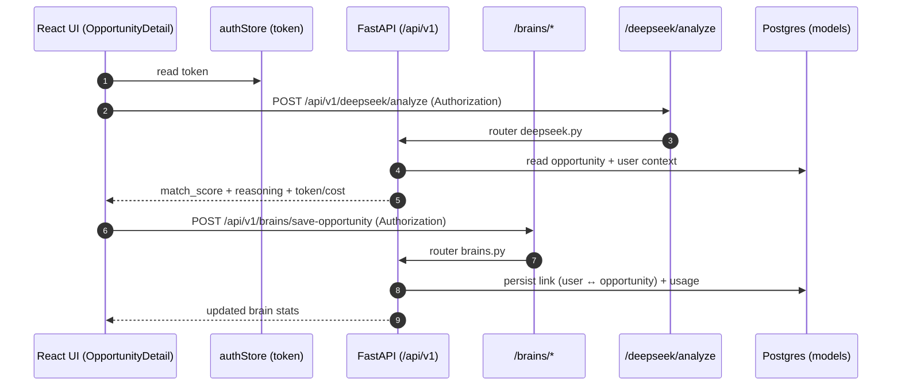

# Code + Feature Diagram (OppGrid / Friction)

This document ties **product features** to the **code that implements them** across the React frontend and FastAPI backend.

---

## Repo map (what lives where)

```mermaid
flowchart LR
  Root[/workspace/] --> Frontend[frontend/\nReact + Vite + TS]
  Root --> Backend[backend/\nFastAPI + SQLAlchemy + Alembic]
  Root --> Static[*.html + js/ + css/\n(legacy/static pages)]
  Root --> Docs[*.md\n(architecture + guides)]
  Root --> Assets[attached_assets/\nimages + misc]

  Frontend --> FPages[src/pages/\nroute-level screens]
  Frontend --> FComponents[src/components/\nUI + layout]
  Frontend --> FStores[src/stores/\nZustand state]
  Frontend --> FServices[src/services/\nAPI clients]

  Backend --> BRouters[app/routers/\nHTTP + WS endpoints]
  Backend --> BServices[app/services/\nbusiness logic]
  Backend --> BModels[app/models/\nDB entities]
  Backend --> BSchemas[app/schemas/\nPydantic I/O]
  Backend --> BCore[app/core/\nconfig + security]
  Backend --> BDb[app/db/\nengine + session]
  Backend --> BMw[app/middleware/\nsecurity + rate limiting]
  Backend --> BAlembic[alembic/\nmigrations]
```

---

## Frontend: routes → features → key code

The route table is defined in `frontend/src/App.tsx`. Most screens sit under `frontend/src/pages/*`.

> Note: `frontend/src/App.tsx` references a `ReportStudio` route component at `frontend/src/pages/build/ReportStudio`, but that file is not present in the current tree—if you intended to ship the “Build → Report Studio” feature, you’ll want to add it.

```mermaid
flowchart TB
  subgraph ReactApp[Frontend (React)]
    App[App.tsx\nRoutes]
    Layout[components/Layout.tsx\nbootstrap auth + navbar]
    Navbar[components/Navbar.tsx\nnav + brain status]
    AuthStore[stores/authStore.ts\nJWT + /users/me + magic link + Replit auth]
    BrainStore[stores/brainStore.ts\nbrain state + timeline]
    BrainApi[services/brainApi.ts\n/brains/* client]
    DeepSeekApi[services/deepseekApi.ts\n/deepseek/analyze client]

    App --> Layout --> Navbar
    Layout --> AuthStore
    Navbar --> AuthStore
    Navbar --> BrainStore
    Navbar --> BrainApi
  end

  subgraph Routes[Key Routes (feature buckets)]
    Public[Public\n/ /discover /pricing /login /signup\n/about /blog /contact /terms /privacy]
    Discover[Discover\n/discover\n/opportunity/:id]
    Build[Build\n/idea-engine\n/build/reports...]
    Saved[Saved\n/saved (auth-gated)]
    Dashboard[Dashboard\n/dashboard (auth-gated)]
    Brain[AI Co-founder\n/brain (auth-gated)]
    Callbacks[Auth callbacks\n/auth/callback\n/auth/magic]
  end

  App --> Public
  App --> Discover
  App --> Build
  App --> Saved
  App --> Dashboard
  App --> Brain
  App --> Callbacks

  Discover -->|save to brain| BrainApi
  Discover -->|deepseek match/analysis| DeepSeekApi
  Saved --> AuthStore
  Dashboard --> AuthStore
  Brain --> BrainStore
  Callbacks --> AuthStore
```

---

## Backend: feature areas → routers → services/models (high-level)

Backend entrypoint: `backend/app/main.py` mounts routers under the `settings.API_V1_PREFIX` (typically `/api/v1`).

```mermaid
flowchart LR
  subgraph FastAPI[Backend (FastAPI)]
    Main[app/main.py\nrouter mounting + middleware]
    Routers[app/routers/*\nHTTP + WebSocket]
    Services[app/services/*\nbusiness logic]
    Models[app/models/*\nSQLAlchemy]
    Schemas[app/schemas/*\nPydantic]
    Core[app/core/*\nconfig + auth + deps]
    Mw[app/middleware/*\nsecurity headers + rate limit]
    Alembic[alembic/\nmigrations]

    Main --> Mw
    Main --> Routers --> Services --> Models
    Routers --> Schemas
    Services --> Core
    Models --> Alembic
  end

  subgraph FeatureAreas[Feature areas (what the API exposes)]
    Auth[Auth\n/auth\n/oauth\n/2fa\n/magic-link\n/replit-auth]
    Marketplace[Marketplace + Profiles\n/experts\n/profiles]
    CoreOpp[Opportunity system\n/opportunities\n/validations\n/comments\n/watchlist\n/follows\n/analytics]
    Payments[Payments\n/subscriptions\n/payments\n(stripe webhooks)]
    AI[AI features\n/brains\n/deepseek\n/ai\n/ai-engine\n/ai-analysis\n/idea-engine\n/idea-validations]
    Ops[Ops + safety\n/admin\n/moderation\n/notifications\n/webhook\n/scraper\n/ws]
  end

  Routers --> Auth
  Routers --> Marketplace
  Routers --> CoreOpp
  Routers --> Payments
  Routers --> AI
  Routers --> Ops
```

---

## Feature → code pointers (practical “where do I change this?”)

| Feature | Frontend code | Backend code |
|---|---|---|
| Authentication (login/signup + session bootstrap) | `frontend/src/stores/authStore.ts`, `frontend/src/components/Layout.tsx` | `backend/app/routers/auth.py`, `backend/app/routers/oauth.py`, `backend/app/routers/magic_link.py`, `backend/app/routers/replit_auth.py`, `backend/app/routers/two_factor.py` |
| Opportunity discovery + detail | `frontend/src/pages/Discover.tsx`, `frontend/src/pages/OpportunityDetail.tsx` | `backend/app/routers/opportunities.py`, `backend/app/routers/analytics.py` |
| Save/bookmark/watchlist | `frontend/src/pages/Saved.tsx` | `backend/app/routers/watchlist.py` |
| Comments + validations | (typically from `OpportunityDetail` UI) | `backend/app/routers/comments.py`, `backend/app/routers/validations.py` |
| “Brain” (AI co-founder state + active brain) | `frontend/src/pages/brain/BrainDashboard.tsx`, `frontend/src/stores/brainStore.ts`, `frontend/src/services/brainApi.ts` | `backend/app/routers/brains.py` |
| DeepSeek analysis (quick match / scoring) | `frontend/src/services/deepseekApi.ts` | `backend/app/routers/deepseek.py`, `backend/app/services/deepseek_service.py` |
| Idea Engine + validations | `frontend/src/pages/IdeaEngine.tsx` | `backend/app/routers/idea_engine.py`, `backend/app/routers/idea_validations.py` |
| Build → Report Studio | `frontend/src/App.tsx` (routes reference `ReportStudio`; expected at `frontend/src/pages/build/ReportStudio.tsx`) | (depends on what reports generate; likely AI endpoints such as `backend/app/routers/ai_engine.py` / `backend/app/routers/ai_analysis.py`) |
| Payments + subscriptions + Stripe webhooks | (pricing/upgrade UI) `frontend/src/pages/Pricing.tsx` | `backend/app/routers/subscriptions.py`, `backend/app/routers/payments.py`, `backend/app/routers/stripe_webhook.py` |
| Admin/moderation | (admin UI, if any) | `backend/app/routers/admin.py`, `backend/app/routers/moderation.py` |
| Notifications + realtime | (UI hooks, if any) | `backend/app/routers/notifications.py`, `backend/app/routers/websocket_router.py`, `backend/app/services/websocket_broadcaster.py` |

---

## One end-to-end example (Brain + DeepSeek)



