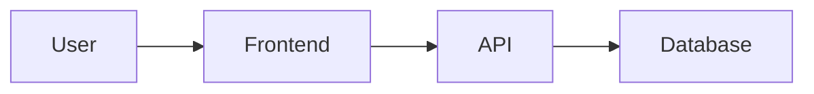

# How to View Architecture Diagrams

The architectural diagrams are created using **Mermaid** syntax and are located in:

📄 **SYSTEM_ARCHITECTURE_DIAGRAM.md**

## 🎨 Ways to View the Diagrams

### Option 1: GitHub (Recommended)
1. Push the file to GitHub
2. View the file on GitHub.com
3. GitHub automatically renders Mermaid diagrams beautifully!

### Option 2: VS Code with Mermaid Extension
1. Install the "Markdown Preview Mermaid Support" extension
2. Open `SYSTEM_ARCHITECTURE_DIAGRAM.md`
3. Press `Ctrl+Shift+V` (or `Cmd+Shift+V` on Mac) to preview
4. Diagrams will render automatically

### Option 3: Online Mermaid Editor
1. Copy the Mermaid code blocks from the markdown file
2. Visit https://mermaid.live/
3. Paste the code in the editor
4. See the diagram rendered instantly
5. Export as SVG or PNG if needed

### Option 4: Replit Preview (if available)
1. Some Replit environments support Mermaid rendering
2. Open the markdown file in Replit's preview pane

## 📊 What Diagrams Are Included?

### 1. Complete Architecture Diagram
- Full system architecture
- Frontend (React + Legacy HTML)
- Backend (FastAPI + 30+ routers)
- Database (PostgreSQL)
- External services (Stripe, OAuth, AI)

### 2. Frontend Architecture
- React component structure
- Legacy HTML page structure
- State management (Zustand stores)
- API service layer

### 3. Backend Architecture
- API router organization (6 categories)
- Service layer architecture
- Business logic flow

### 4. Database Schema
- Entity-relationship diagram
- 20+ tables with relationships
- Primary keys, foreign keys, unique constraints

### 5. Data Flow Diagrams
- Complete authentication flow (Email/OAuth/Magic Link/2FA)
- AI Brain + DeepSeek analysis flow
- Stripe payment & subscription flow
- Opportunity submission with duplicate detection

### 6. Security Architecture
- 7-layer security model
- Authentication methods comparison
- Security controls at each layer

### 7. Deployment Architecture
- Replit deployment model
- Container runtime
- Port configuration
- Environment management

## 🚀 Quick Example

Here's what the Mermaid syntax looks like:

This renders as a simple flowchart showing User → Frontend → API → Database.

## 💡 Pro Tips

1. **GitHub is the easiest**: Just push and view on github.com
2. **VS Code is great for editing**: Install the extension for live preview
3. **Mermaid Live Editor** (https://mermaid.live/): Best for sharing or exporting diagrams
4. **Export options**: Most tools let you export as SVG, PNG, or PDF

## 📝 Diagram Files in This Project

| File | Content | Diagrams |
|------|---------|----------|
| `SYSTEM_ARCHITECTURE_DIAGRAM.md` | **NEW** Complete system architecture | 15+ diagrams |
| `ARCHITECTURE_DIAGRAM.md` | Original architecture flows | 10+ diagrams |
| `CODE_AND_FEATURE_DIAGRAM.md` | Code structure & feature mapping | 3 diagrams |

## 🔗 Mermaid Documentation

- Official Docs: https://mermaid.js.org/
- Live Editor: https://mermaid.live/
- Syntax Guide: https://mermaid.js.org/intro/

---

**Enjoy exploring your system architecture!** 🎉
