# OppGrid Platform Architecture Diagrams

Source: `https://chat.deepseek.com/share/7fjq9vl7ges30uwpmy`

---

# **📊 OppGrid Platform Architecture Diagrams**

## **1. SYSTEM ARCHITECTURE DIAGRAM**
*(High-Level Business & Functional View)*

```mermaid
flowchart TB
    subgraph FrontendLayer["🎨 Frontend Layer"]
        WebApp["Web Application<br/>React + TypeScript"]
        MobileApp["Mobile App<br/>React Native"]
        AdminPanel["Admin Dashboard<br/>Enterprise Management"]
        PublicSite["Marketing Site<br/>SEO Optimized"]
    end
    
    subgraph APILayer["🔗 API & Gateway Layer"]
        APIGateway["API Gateway<br/>Kong/NGINX"]
        LoadBalancer["Load Balancer<br/>Global Distribution"]
        CDN["CDN<br/>Static Assets"]
        WAF["WAF & DDoS Protection"]
    end
    
    subgraph CoreServices["⚙️ Core Microservices"]
        AuthService["Auth Service<br/>JWT/OAuth/2FA"]
        UserService["User Service<br/>Profiles/Preferences"]
        ContentService["Content Service<br/>Opportunities/Docs"]
        PaymentService["Payment Service<br/>Stripe Integration"]
        MarketplaceService["Marketplace Service<br/>Services/Orders"]
        NetworkService["Network Service<br/>Community/Chat"]
        AIService["AI Service<br/>Brain AI Integration"]
        AnalyticsService["Analytics Service<br/>Metrics/Insights"]
    end
    
    subgraph AILayer["🧠 AI & Intelligence Layer"]
        BrainAI["Sintra Brain AI<br/>Personalization Engine"]
        OpenAI["OpenAI/GPT<br/>Content Generation"]
        VectorDB["Vector Database<br/>Semantic Search"]
        MLModels["ML Models<br/>Predictive Analytics"]
    end
    
    subgraph DataLayer["💾 Data Layer"]
        PostgreSQL["PostgreSQL Cluster<br/>Primary Data Store"]
        Redis["Redis Cluster<br/>Caching & Sessions"]
        Elasticsearch["Elasticsearch<br/>Search & Analytics"]
        S3["S3/Object Storage<br/>Files & Media"]
        ClickHouse["ClickHouse<br/>Analytics DB"]
    end
    
    subgraph ExternalServices["🌐 External Services"]
        Stripe["Stripe<br/>Payments & Subscriptions"]
        SendGrid["SendGrid<br/>Email & Notifications"]
        Twilio["Twilio<br/>SMS & Verification"]
        AWS["AWS Services<br/>S3, SQS, Lambda"]
        Google["Google APIs<br/>Auth, Maps, Analytics"]
    end
    
    subgraph UserTypes["👥 User Types & Access"]
        Anonymous["Anonymous Visitors<br/>Browse public content"]
        FreeUsers["Free Users<br/>Basic access & network"]
        ProUsers["Pro Users<br/>Full platform access"]
        Creators["Creators/Experts<br/>Marketplace providers"]
        Enterprises["Enterprise Clients<br/>Custom solutions"]
        Admins["Administrators<br/>Platform management"]
    end
    
    %% CONNECTIONS
    UserTypes --> FrontendLayer
    FrontendLayer --> APILayer
    APILayer --> CoreServices
    
    CoreServices --> AILayer
    CoreServices --> DataLayer
    CoreServices --> ExternalServices
    
    AILayer --> DataLayer
    AILayer --> ExternalServices
    
    DataLayer --> ExternalServices
    
    %% STYLING
    style FrontendLayer fill:#dbeafe,stroke:#3b82f6
    style APILayer fill:#fef3c7,stroke:#f59e0b
    style CoreServices fill:#dcfce7,stroke:#22c55e
    style AILayer fill:#fae8ff,stroke:#c026d3
    style DataLayer fill:#fee2e2,stroke:#ef4444
    style ExternalServices fill:#f0f9ff,stroke:#0369a1
    style UserTypes fill:#f5f3ff,stroke:#8b5cf6
```



---

## **2. TECHNICAL ARCHITECTURE DIAGRAM**
*(Detailed Infrastructure & Deployment View)*

```mermaid
flowchart TB
    subgraph CloudProvider["☁️ Cloud Infrastructure (AWS/GCP)"]
        subgraph NetworkLayer["🌐 Network Layer"]
            VPC["VPC/Virtual Network<br/>10.0.0.0/16"]
            subgraph PublicSubnets["Public Subnets"]
                LoadBalancers["Application Load Balancers<br/>SSL Termination"]
                NATGateways["NAT Gateways<br/>Outbound Internet"]
                BastionHosts["Bastion Hosts<br/>Admin Access"]
            end
            
            subgraph PrivateSubnets["Private Subnets"]
                AppSubnets["Application Subnets<br/>10.0.1.0/24"]
                DataSubnets["Database Subnets<br/>10.0.2.0/24"]
                CacheSubnets["Cache Subnets<br/>10.0.3.0/24"]
            end
            
            VPC --> PublicSubnets
            VPC --> PrivateSubnets
        end
        
        subgraph ContainerOrchestration["🐳 Container Orchestration"]
            subgraph EKSCluster["Kubernetes Cluster (EKS/GKE)"]
                subgraph NodeGroups["Node Groups"]
                    SpotNodes["Spot Nodes<br/>Stateless workloads"]
                    OnDemandNodes["On-Demand Nodes<br/>Stateful workloads"]
                    GPUNodes["GPU Nodes<br/>AI/ML workloads"]
                end
                
                subgraph Namespaces["Kubernetes Namespaces"]
                    ProductionNS["production<br/>Live services"]
                    StagingNS["staging<br/>Pre-production"]
                    MonitoringNS["monitoring<br/>Observability tools"]
                end
                
                subgraph IngressControllers["Ingress Controllers"]
                    NginxIngress["Nginx Ingress<br/>HTTP routing"]
                    ALBIngress["AWS ALB Ingress<br/>Load balancing"]
                end
            end
        end
        
        subgraph DataServices["🗄️ Managed Data Services"]
            RDS["Amazon RDS/Aurora<br/>PostgreSQL 15"]
            ElastiCache["Amazon ElastiCache<br/>Redis 7"]
            OpenSearch["Amazon OpenSearch<br/>Elasticsearch"]
            S3["Amazon S3<br/>Object storage"]
            ManagedKafka["Amazon MSK<br/>Kafka clusters"]
        end
        
        subgraph Serverless["🚀 Serverless Functions"]
            LambdaFunctions["AWS Lambda<br/>Event processing"]
            StepFunctions["Step Functions<br/>Workflow orchestration"]
            EventBridge["EventBridge<br/>Event bus"]
            SQS["SQS/SNS<br/>Message queues"]
        end
    end
    
    subgraph MonitoringStack["📊 Monitoring & Observability"]
        Prometheus["Prometheus<br/>Metrics collection"]
        Grafana["Grafana<br/>Dashboards & alerts"]
        Loki["Loki<br/>Log aggregation"]
        Tempo["Tempo<br/>Distributed tracing"]
        AlertManager["Alert Manager<br/>Notification routing"]
    end
    
    subgraph CICDPipeline["🔄 CI/CD Pipeline"]
        GitHub["GitHub Repository<br/>Source code"]
        GitHubActions["GitHub Actions<br/>Build & test"]
        ContainerRegistry["Container Registry<br/>Docker images"]
        ArgoCD["ArgoCD<br/>GitOps deployment"]
        Terraform["Terraform<br/>Infrastructure as Code"]
    end
    
    subgraph SecurityLayer["🔐 Security & Compliance"]
        WAF["AWS WAF<br/>Web application firewall"]
        Shield["AWS Shield<br/>DDoS protection"]
        KMS["AWS KMS<br/>Key management"]
        SecretsManager["Secrets Manager<br/>Credentials storage"]
        IAM["IAM Roles<br/>Least privilege access"]
    end
    
    subgraph MicroservicesDeployment["⚡ Microservices Deployment"]
        subgraph StatelessServices["Stateless Services (Auto-scaling)"]
            AuthService["auth-service:3 replicas<br/>HPA: CPU 70%"]
            UserService["user-service:4 replicas<br/>HPA: CPU 70%"]
            APIService["api-service:6 replicas<br/>HPA: CPU 80%"]
            NotificationService["notification-service:2 replicas<br/>HPA: Messages"]
        end
        
        subgraph StatefulServices["Stateful Services (Fixed)"]
            PaymentService["payment-service:2 replicas<br/>Sticky sessions"]
            AIService["ai-service:3 replicas<br/>GPU enabled"]
            WebSocketService["websocket-service:4 replicas<br/>Session affinity"]
        end
        
        subgraph JobWorkers["Job Workers & Queues"]
            EmailWorker["email-worker:2 replicas<br/>SQS consumer"]
            AnalyticsWorker["analytics-worker:3 replicas<br/>Kafka consumer"]
            ProcessingWorker["processing-worker:4 replicas<br/>Batch jobs"]
        end
    end
    
    subgraph DataFlow["📈 Data Flow Architecture"]
        APIGateway["API Gateway"] --> ServiceMesh["Service Mesh (Istio)"]
        ServiceMesh --> MicroservicesDeployment
        
        MicroservicesDeployment --> Kafka["Apache Kafka<br/>Event streaming"]
        Kafka --> StreamProcessing["Kafka Streams<br/>Real-time processing"]
        Kafka --> DataWarehouse["Data Warehouse (Snowflake/Redshift)"]
        
        StreamProcessing --> RealTimeDB["Real-time DB (Redis Timeseries)"]
        DataWarehouse --> BI["Business Intelligence (Metabase)"]
    end
    
    %% CONNECTIONS
    CloudProvider --> MonitoringStack
    CloudProvider --> SecurityLayer
    CICDPipeline --> CloudProvider
    
    NetworkLayer --> ContainerOrchestration
    ContainerOrchestration --> DataServices
    ContainerOrchestration --> Serverless
    
    MicroservicesDeployment --> DataFlow
    DataFlow --> DataServices
    
    %% STYLING
    style CloudProvider fill:#f0f9ff,stroke:#0369a1
    style NetworkLayer fill:#dbeafe,stroke:#3b82f6
    style ContainerOrchestration fill:#dcfce7,stroke:#22c55e
    style DataServices fill:#fee2e2,stroke:#ef4444
    style Serverless fill:#fef3c7,stroke:#f59e0b
    style MonitoringStack fill:#f5f3ff,stroke:#8b5cf6
    style CICDPipeline fill:#fce7f3,stroke:#db2777
    style SecurityLayer fill:#fffbeb,stroke:#d97706
    style MicroservicesDeployment fill:#ecfdf5,stroke:#10b981
    style DataFlow fill:#f0fdf4,stroke:#16a34a
```

---

## **3. COMPONENT DETAILS MATRIX**

### **Frontend Components:**
| Component | Technology | Purpose | Scale Target |
|-----------|------------|---------|--------------|
| **Web App** | React 18 + TypeScript + Vite | Main user interface | 100K concurrent |
| **Mobile App** | React Native + Expo | Mobile experience | 50K concurrent |
| **Admin Panel** | React + Material UI | Platform management | 100 concurrent |
| **Marketing Site** | Next.js + SSR | SEO & acquisition | 10K concurrent |

### **Backend Services:**
| Service | Language | Primary DB | Replicas | Autoscale |
|---------|----------|------------|----------|-----------|
| **auth-service** | Node.js + TypeScript | Redis | 3-10 | CPU > 70% |
| **user-service** | Node.js + TypeScript | PostgreSQL | 4-12 | CPU > 70% |
| **content-service** | Node.js + TypeScript | PostgreSQL + S3 | 6-18 | CPU > 80% |
| **payment-service** | Node.js + TypeScript | PostgreSQL | 2-6 | Fixed + manual |
| **marketplace-service** | Node.js + TypeScript | PostgreSQL | 4-12 | CPU > 75% |
| **network-service** | Node.js + TypeScript | Redis + PostgreSQL | 8-24 | Connections > 5K |
| **ai-service** | Python + FastAPI | Redis + VectorDB | 3-9 | GPU memory > 85% |
| **analytics-service** | Go + ClickHouse | ClickHouse | 4-12 | Queue depth > 100 |

### **Data Storage:**
| Storage | Technology | Purpose | Retention | Backup |
|---------|------------|---------|-----------|---------|
| **Primary Database** | PostgreSQL 15 + Patroni | Core application data | 7 years | Daily + WAL |
| **Cache** | Redis 7 Cluster | Sessions, rate limiting | Ephemeral | RDB + AOF |
| **Search Index** | Elasticsearch 8.x | Full-text search | 2 years | Snapshot to S3 |
| **Object Storage** | S3/Cloud Storage | Files, media, backups | Unlimited | Versioning |
| **Time Series** | ClickHouse | Analytics, metrics | 13 months | Replicated |
| **Vector Database** | Pinecone/Weaviate | AI embeddings | 1 year | Managed |

### **Infrastructure:**
| Component | Technology | Configuration | Purpose |
|-----------|------------|---------------|---------|
| **Container Runtime** | Docker 20+ | Multi-stage builds | Application packaging |
| **Orchestration** | Kubernetes 1.27+ | 3 control planes, 10+ workers | Container management |
| **Service Mesh** | Istio 1.18+ | mTLS, traffic splitting | Service communication |
| **API Gateway** | Kong 3.4+ | Rate limiting, authentication | API management |
| **Load Balancer** | AWS ALB/NLB | SSL termination, WAF integration | Traffic distribution |
| **CDN** | Cloudflare Pro | Global caching, DDoS protection | Static assets |

### **Monitoring Stack:**
| Tool | Purpose | Metrics/Alerts |
|------|---------|----------------|
| **Prometheus** | Metrics collection | 1M+ metrics, 15s scrape |
| **Grafana** | Visualization | 50+ dashboards, 100+ alerts |
| **Loki** | Log aggregation | 100GB/day, 7-day retention |
| **Tempo** | Distributed tracing | 10K traces/sec, 1-day retention |
| **AlertManager** | Alert routing | PagerDuty, Slack, email |
| **Sentry** | Error tracking | Real-time error monitoring |

---

## **4. NETWORK ARCHITECTURE DETAILS**


---

## **5. DEPLOYMENT PIPELINE ARCHITECTURE**

```mermaid
flowchart LR
    subgraph Development["💻 Development Phase"]
        LocalDev["Local Development<br/>Docker Compose"]
        FeatureBranches["Feature Branches<br/>GitHub Flow"]
        CodeReview["Code Review<br/>GitHub PRs"]
        UnitTests["Unit Tests<br/>Jest/Vitest"]
    end
    
    subgraph CI["🔄 Continuous Integration"]
        Build["Build & Test<br/>GitHub Actions"]
        Containerize["Containerize<br/>Multi-stage Docker"]
        SecurityScan["Security Scan<br/>Trivy/Snyk"]
        ImagePush["Push to Registry<br/>ECR/GCR"]
    end
    
    subgraph CD[" 🚀 Continuous Deployment"]
        subgraph Environments["Deployment Environments"]
            DevelopmentEnv["Development<br/>Auto-deploy PRs"]
            StagingEnv["Staging<br/>Manual approval"]
            ProductionEnv["Production<br/>Blue-Green deploy"]
        end
        
        Infrastructure["Infrastructure<br/>Terraform apply"]
        Configuration["Configuration<br/>Helm/ArgoCD"]
        Migration["Database Migrations<br/>Safe, reversible"]
        Validation["Smoke Tests<br/>API validation"]
    end
    
    subgraph Monitoring["📊 Post-Deployment"]
        HealthChecks["Health Checks<br/>K8s readiness/liveness"]
        Performance["Performance Monitoring<br/>New Relic/Datadog"]
        ErrorTracking["Error Tracking<br/>Sentry"]
        Rollback["Auto Rollback<br/>If metrics degrade"]
    end
    
    Development --> CI
    CI --> CD
    CD --> Monitoring
    Monitoring -.->|Feedback| Development
    
    %% STYLING
    style Development fill:#dbeafe,stroke:#3b82f6
    style CI fill:#dcfce7,stroke:#22c55e
    style CD fill:#fef3c7,stroke:#f59e0b
    style Monitoring fill:#fee2e2,stroke:#ef4444
```



---

## **6. SECURITY ARCHITECTURE LAYERS**

| Layer | Security Measures | Tools/Technologies |
|-------|-------------------|-------------------|
| **Network** | VPC isolation, Security Groups, NACLs | AWS VPC, WAF, Shield |
| **Application** | Input validation, Rate limiting, CSRF protection | OWASP guidelines, Helmet.js |
| **Data** | Encryption at rest & transit, Key management | AWS KMS, TLS 1.3, AES-256 |
| **Access** | RBAC, MFA, Least privilege, JWT | Auth0/Cognito, IAM, OAuth 2.0 |
| **Monitoring** | SIEM, Audit logging, Anomaly detection | Splunk, CloudTrail, GuardDuty |
| **Compliance** | GDPR, CCPA, SOC 2, PCI DSS | Automated compliance checks |

---

## **7. SCALING STRATEGIES**

### **Horizontal Scaling:**

```yaml
autoscaling:
  auth-service:
    min_replicas: 3
    max_replicas: 10
    metrics:
    - type: Resource
      resource:
        name: cpu
        target:
          type: Utilization
          averageUtilization: 70
    - type: Pods
      pods:
        metric:
          name: http_requests_per_second
        target:
          type: AverageValue
          averageValue: 1000
```

### **Database Scaling:**
1. **Read Replicas**: 3 read replicas for PostgreSQL
2. **Connection Pooling**: PgBouncer for connection management
3. **Sharding Strategy**: User-based sharding after 1M users
4. **Caching Layer**: Redis cache with 30% hit rate target

### **CDN Strategy:**
- **Static Assets**: All JS/CSS/images via CDN
- **API Caching**: 5-minute cache for public endpoints
- **Dynamic Content**: Edge computing for personalization

---

## **🎯 KEY ARCHITECTURAL DECISIONS**

1. **Microservices over Monolith**: For independent scaling and team autonomy
2. **Kubernetes over ECS/Fargate**: For portability and ecosystem
3. **PostgreSQL over NoSQL**: For ACID compliance and relational data
4. **Event-Driven Architecture**: For loose coupling and scalability
5. **Managed Services where possible**: For reduced operational overhead
6. **Multi-Region from Day 1**: For global scalability and DR
7. **Infrastructure as Code**: For reproducibility and auditability
8. **Zero-Trust Security Model**: For comprehensive protection
